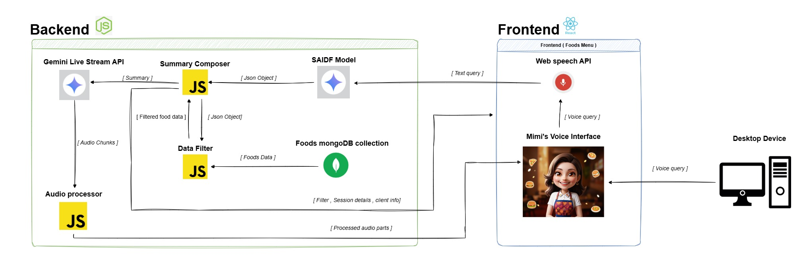

# 🍽️ Mimi – Your Real-Time Voice Food Assistant


Mimi is a real-time, voice-interactive AI assistant for food discovery. Built with SAIDF (Smart AI Data Filtering), Gemini voice models, and a modern full-stack framework, Mimi helps users effortlessly explore menus, filter based on preferences, and receive friendly voice recommendations just like talking to a real food stylist!

---

## 🌐 Demo

Try Mimi live at [talk-to-mimi.vercel.app](https://talk-to-mimi.vercel.app)!

---

## 📰 Data Flow Diagram



---

## ⚙️ Installation & Setup

### 1. Clone the Repository

```bash
gh repo clone DileepWick/public-talk-to-mimi
cd public-talk-to-mimi
```

---

### 2. Backend Setup

```bash
cd server
npm install
```

Create a `.env` file inside `/server`:

```ini
MONGO_URI=your_mongo_connection_string
GEMINI_API_KEY=your_gemini_api_key
```

**System Prompts Requirement**: This project requires specific system prompts for the SAIDF and Voice Gemini models, defined in `server/config/modelSystemPrompts.js`. These prompts are not included in this repository due to their proprietary nature. To obtain the prompts, please contact the author at [wickramasinghemgdd@gmail.com] or open an issue on this repository with your request. You will receive the `modelSystemPrompts.js` file or its contents upon approval.

Start the backend server:

```bash
npm start
```

---

### 3. Frontend Setup

```bash
cd ../client
npm install
npm run dev
```

---

## 🧠 How Mimi Works

1. User speaks into the microphone.
2. Frontend sends audio or text to the backend.
3. Backend processes input through:
   - **SAIDF Gemini Model**: Filters food based on user preferences using a custom prompt.
   - **Voice Gemini Model**: Generates natural spoken responses using a custom prompt.
4. Real-time responses are streamed via **WebSockets**.
5. Mimi responds instantly with voice and updated UI.

**Note**: The application will not function without the required system prompts in `server/config/modelSystemPrompts.js`. Contact the author to request these prompts.

---

## 🚀 Features

- 🎤 **Live voice interaction** (mic input + voice output)
- 🧠 **Smart food filtering** using SAIDF logic
- 🔄 **Real-time WebSocket streaming**
- 💬 **Personality-rich voice assistant** (Mimi)
- 📱 **Responsive frontend UI** (Vite + React + Tailwind CSS)
- 🌐 **Google Gemini integration** (Live & Pro models)
- 🧪 **Tested with realistic user conversations**

---

## 📌 Future Improvements

- 🔐 User authentication + saved preferences
- 🗣️ Enable user voice feedback on dishes
- 🍱 Expand to multi-cuisine menu support
- 🧾 Real-time ordering system
- 🧬 Use vector search for natural language menu queries

---

## 🧪 Project Status

✅ MVP Completed  
✅ Voice Input/Output Integration  
✅ Dual Gemini Model Integration  
✅ WebSocket-based Streaming  
✅ Ready for Deployment (Vercel & Node)

---

## 👨‍💻 Author

**Dileepa Wickramasinghe**  
3rd-Year Software Engineering Student | AI Enthusiast  

---

## 📜 License

This project is open source and available under the **MIT License**.
